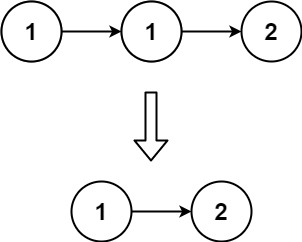

Given the head of a sorted linked list, delete all duplicates such that each element appears only once. Return the linked list sorted as well.


### Example 1:

````
Input: head = [1,1,2]
Output: [1,2]
````

### Example 2:

````
Input: head = [1,1,2,3,3]
Output: [1,2,3]
````

### Constraints:

* The number of nodes in the list is in the range [0, 300].
* -100 <= Node.val <= 100
* The list is guaranteed to be sorted in ascending order.